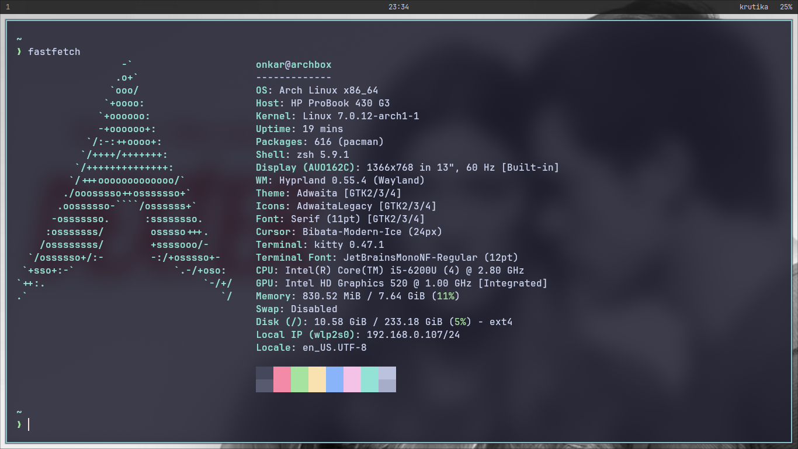
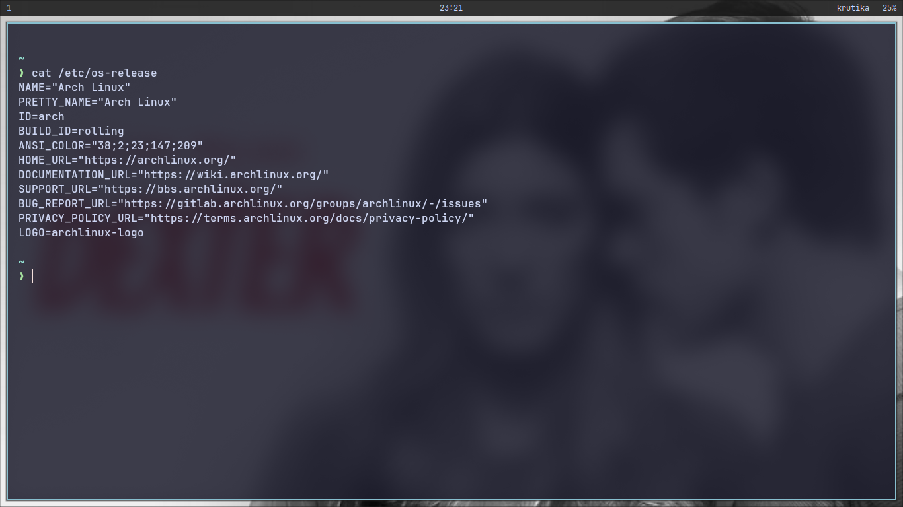
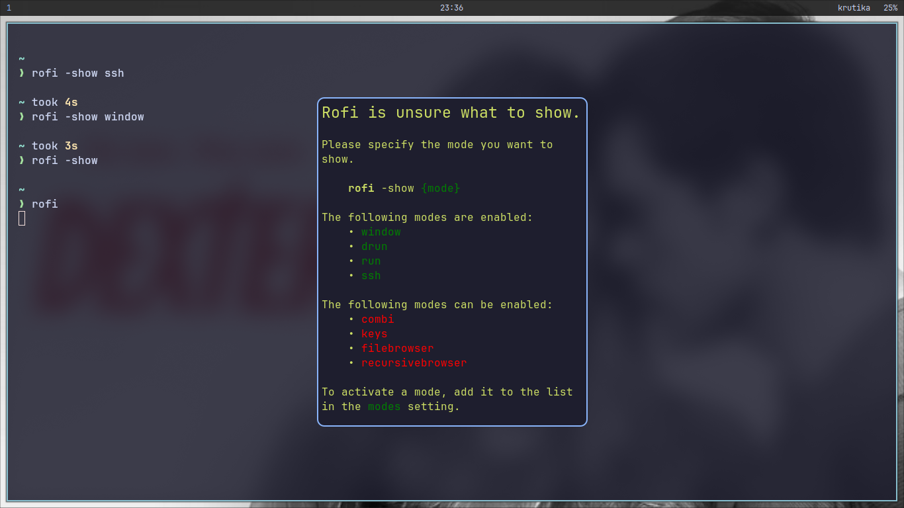
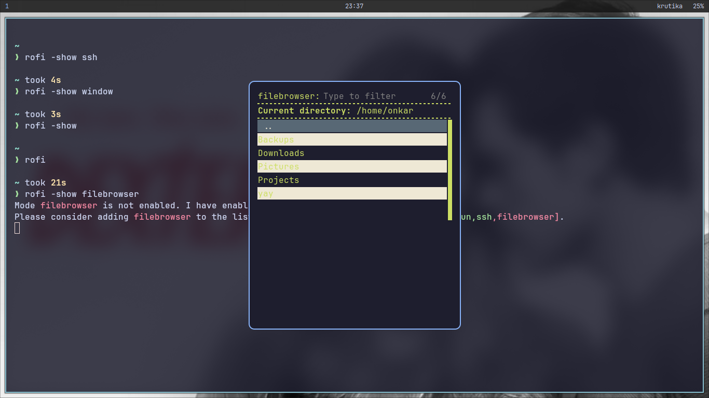
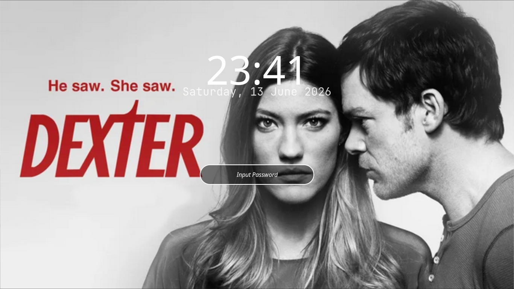
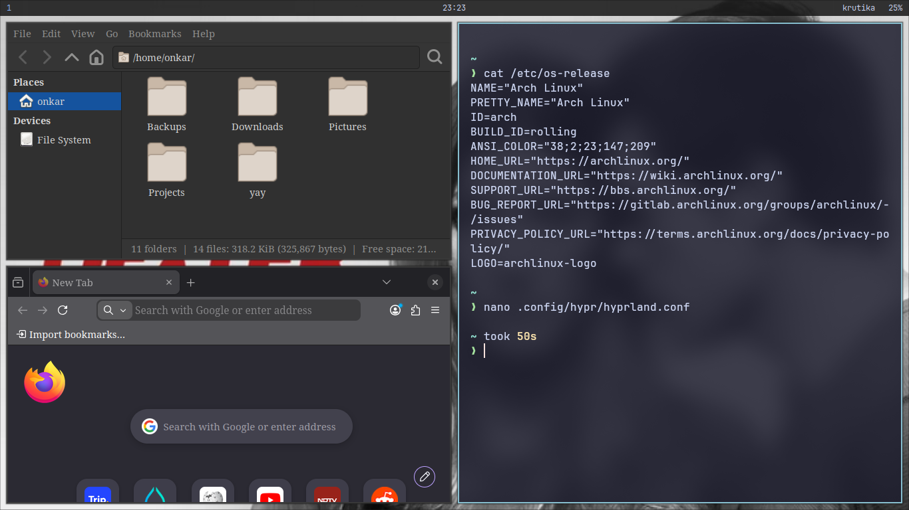

# Arch Hyprland Workstation


A custom Arch Linux workstation built from scratch on an HP ProBook using Hyprland, Wayland, Kitty, Waybar, Rofi, and modern Linux tooling.

This project documents my journey from a fresh Arch Linux installation to a fully customized Wayland desktop environment while learning Linux internals, system administration, debugging, and workflow optimization.

## About

This project started as a learning journey to understand Linux beyond traditional desktop environments, from learning what EFI is to publishing a documented Arch Linux workstation project.

Rather than using a preconfigured setup, I manually built an Arch Linux workstation using Hyprland and Wayland while documenting the challenges, debugging process, and lessons learned along the way.

The goal was not only customization, but also gaining hands-on experience with Linux internals, package management, system services, Wayland tooling, Git, and modern desktop workflows.

## Screenshots

### Desktop


### Fastfetch



### Kitty Terminal



### Rofi Launcher



### File Browser



### Lockscreen



### Workspace



---

## Hardware

* HP ProBook
* Intel Core i5
* 8 GB RAM
* 256 GB SSD

---

## Software Stack

### Operating System

* Arch Linux

### Wayland Environment

* Hyprland
* Waybar
* Hyprlock
* Hypridle
* Hyprpaper

### Terminal

* Kitty
* Zsh
* Starship
* Fastfetch

### Application Launcher

* Rofi

### File Manager

* Thunar

### Screenshots

* Grim
* Slurp
* Grimblast

### Security

* nftables

### Package Management

* pacman
* yay

---

## Features

* Custom Hyprland configuration
* Waybar customization
* Kitty terminal theming
* Starship prompt
* Fastfetch integration
* Custom lockscreen
* Wallpaper management
* Screenshot workflow
* Wayland clipboard integration
* Cursor trail effects
* Brightness controls
* Audio controls
* AUR support
* Git-managed configuration files

---

## Keybindings

| Keybind           | Action          |
| ----------------- | --------------- |
| SUPER + ENTER     | Open Kitty      |
| SUPER + D         | Open Rofi       |
| SUPER + E         | Open Thunar     |
| SUPER + B         | Open Firefox    |
| SUPER + Q         | Close Window    |
| SUPER + L         | Lock Screen     |
| SUPER + S         | Full Screenshot |
| SUPER + SHIFT + S | Area Screenshot |

---

## Project Structure

```text
arch-hyprland-workstation/
├── docs/
├── hypr/
├── kitty/
├── rofi/
├── screenshots/
├── wallpapers/
├── waybar/
└── README.md
```

---

## Documentation

Detailed project documentation is available in:

```text
docs/project_journey.md
```

Topics covered:

* Arch Linux installation
* Networking setup
* Hyprland configuration
* Waybar customization
* Kitty setup
* Hyprlock configuration
* Screenshot workflow
* nftables firewall setup
* Debugging challenges
* Lessons learned

---

## Why This Project?

This project was created to learn Linux by building and troubleshooting a complete workstation environment instead of relying on preconfigured desktop environments.

The goal was not only customization, but also understanding:

* Linux internals
* Wayland ecosystem
* Package management
* System services
* Configuration management
* Debugging methodology

---

## Future Plans

* Advanced terminal workflows
* tmux or zellij
* Neovim customization
* Additional Wayland widgets
* Further workflow automation

---

## License

This repository is intended as a personal learning and showcase project.
